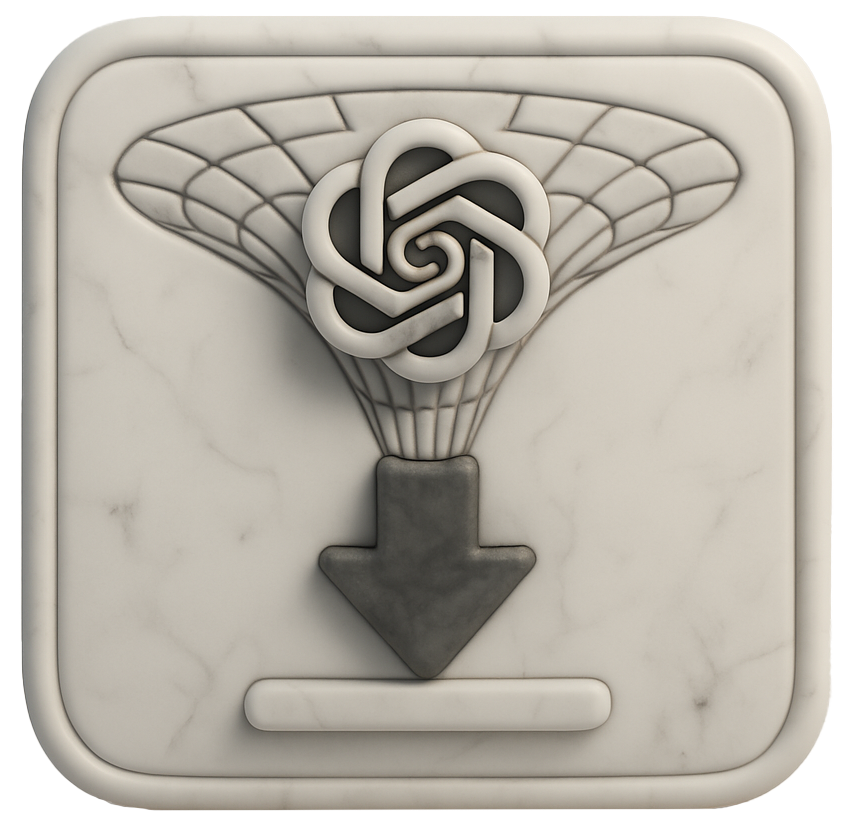

<h1 align="center"> OAI Image Recorder </h1>

  

A browser extension to help you seize the memes of production.

## What

OAI Image Recorder optionally downloads all image data coming from OpenAI, and saves these images to a local folder.

## Internals

- Records all images sent from `*.oaiusercontent.com` subdomains to your browser client while the extension is recording
- Saves everything to a local folder called `oai_img_recorder` in your default downloads directory (OAI helpfully timestamps the image in the name; neat)
- Does not send any data anywhere; 100% local compute
- Only works with the web UI of ChatGPT, obviously

## Installation

1. Clone this repository (or download it, if copy-paste is too complicated)
2. Open Chrome and navigate to `chrome://extensions/` (the address bar is at the top, by the way)
3. Turn on "Developer Mode" (because you're basically a hacker now)
4. Click "Load unpacked" and select the `img_recorder` directory (it's the one with code in it)
5. The extension should now appear in your Chrome toolbar, ready to do your bidding

## Use Cases
- Capture all intermediate states of new 4o image generation, for research purposes
- Local content archival:
  - Save all the images from a chat, or multiple (start recording, then reload that chat, or load a new one)
  - Any OAI image content your client GETs, this extension will download. The web ui doesn't seem to cache very greedily, so you should get everything on reload
  - Note: this method won't automatically fetch content variations on the same prompt. You'll need to manually surface them to trigger those downloads

## Disclaimers

- Not tested on Sora; might download thumbnails, probably not
- Given the limited download scope, should be safe to keep recording indefinitely. We leave this to your discretion.

